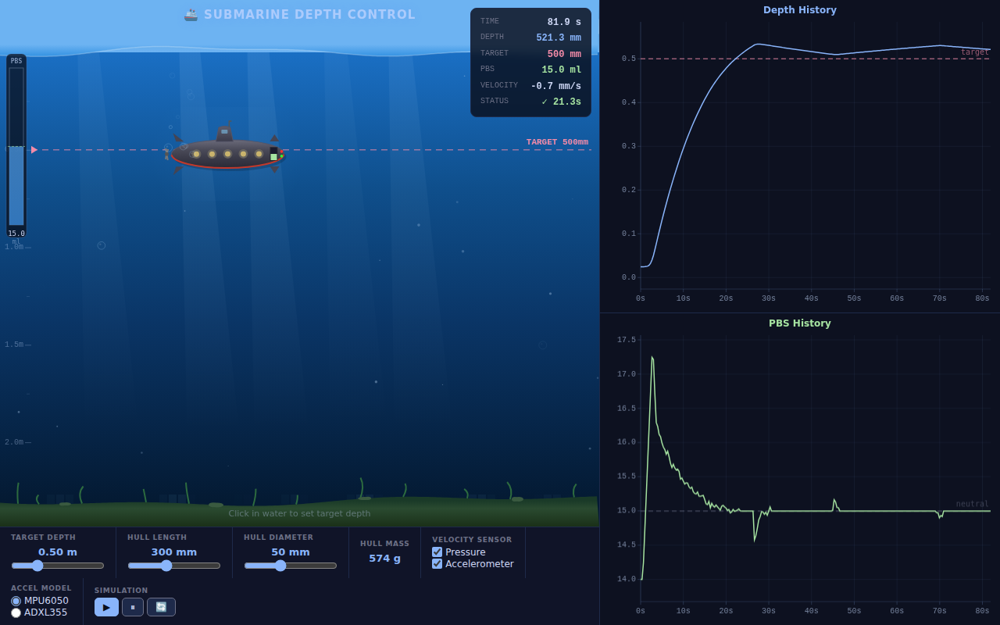
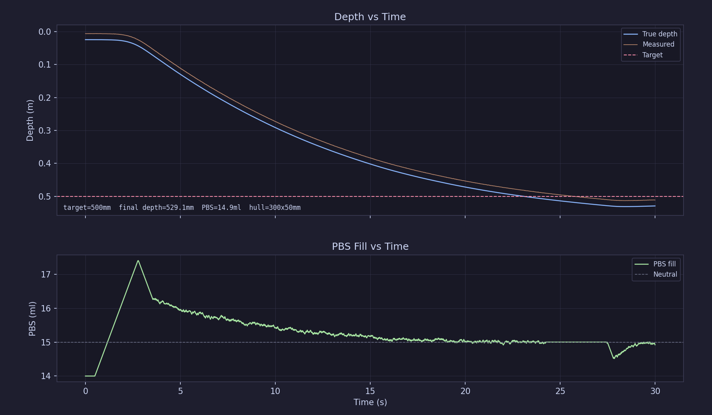

# Submarine PID Depth Control — Podsumowanie projektu

## Uruchomienie

```bash
# Symulacja konsolowa (60s, wyniki w tabeli)
python python/main.py

# Z wyborem akcelerometru, trybu i parametrów
python python/main.py --accel adxl355 --mode pressure --target 0.15 --time 30

# Z regulacją masy kadłuba i objętości
python python/main.py --weight 600 --volume 620

# Porównanie wariantów masy/objętości (tabela wyników)
python python/run_variants.py

# Interaktywne GUI (wykresy real-time, suwak głębokości, przełączniki sensorów)
python python/gui.py
```

Wymagania: Python 3.10+, `matplotlib` z backendem Qt5 (tylko dla GUI).

### Wersja webowa (GitHub Pages)

Symulacja dostępna jako statyczna strona w przeglądarce — port implementacji Python do JavaScript z wizualizacją na HTML5 Canvas, bez zewnętrznych zależności.

Otwórz `web/index.html` w przeglądarce lub odwiedź wdrożoną wersję:

**👉 https://adamtrepka.github.io/submarine-sim/**



### GUI (Python)



## Cel projektu

Symulacja sterowania głębokością modelu łodzi podwodnej za pomocą regulatora PID z realistycznymi modelami fizyki, czujników i aktuatora (Piston Ballast System). Projekt powstał iteracyjnie w kilku sesjach, ewoluując od prostego demo termicznego do pełnej symulacji z realistycznymi sensorami.

---

## Chronologia prac

### Faza 1: Demo PID — regulacja temperatury

Punkt wyjścia: prosty regulator PID sterujący modelem grzałki (20°C → 100°C setpoint).

- Zaimplementowano klasę `PidController` z członami P, I, D
- Problem: domyślne nastawy generowały overshoot do ~117°C
- **Analityczne dobieranie parametrów:** Wyznaczono transmitancję obiektu `G(s) = 0.1 / (s + 0.02)` i warunek na tłumienie nadkrytyczne (ζ ≥ 1):
  ```
  (0.02 + 0.1·Kp)² ≥ 4·(1 + 0.1·Kd)·0.1·Ki
  ```
- Finalne nastawy bez overshootu: **Kp=0.2, Ki=0.002, Kd=5.0** (ζ ≈ 1.15)
- Kompromis: wolne dociąganie (~98.6°C po 500s)

Następnie zbadano wariant z **Kd=0** (regulator PI):
- Z nastawami Kp=0.772, Ki=0.0236 cel osiągnięty w 35s, ale z ~3% overshootem
- **Wniosek fundamentalny:** z regulatorem PI bez overshootu odpowiedź jest asymptotyczna — temperatura zbliża się do celu od dołu, ale nigdy go nie osiąga dokładnie w skończonym czasie

### Faza 2: Model łodzi podwodnej — definicja fizyki

Przejście od modelu termicznego do sterowania zanurzeniem łodzi podwodnej.

**Parametry fizyczne podane przez użytkownika:**
- Cylinder poziomy: L=30cm, ø=5cm
- Masa kadłuba: 0.5 kg (później skorygowana do 0.57 kg)
- Piston Ballast System (PBS): pojemność 30ml
- Cel: zanurzenie z powierzchni na głębokość 0.5m

**Kluczowy problem zidentyfikowany na starcie:**
Objętość cylindra V ≈ 589 ml → neutralna pływalność wymaga 589g masy. Przy masie kadłuba 500g i PBS 30ml, łódź nigdy nie osiągnęłaby neutralnej pływalności (max 530g < 589g). Zaproponowano korektę masy do **570g** — wtedy do neutralności potrzeba 19ml, a 30ml PBS daje 11ml zapasu.

**Poprawka geometrii:** Użytkownik zwrócił uwagę, że cylinder leży **poziomo**, nie pionowo. To zmienia obliczenia częściowego zanurzenia — zamiast prostego przekroju kołowego trzeba użyć wzoru na segment kołowy:
```
A(d) = r²·arccos(-d/r) + d·√(r²-d²)
V_zanurzone = A · L
```

### Faza 3: Próby strojenia PI (Kd=0) — udowodnienie niemożliwości

Seria eksperymentów z regulatorem PI na modelu łodzi:

| Nastawy | Wynik |
|---------|-------|
| Kp=40, Ki=2 | Oscylacje ±5mm, brak overshootu, ale cel w ~100s (za wolno) |
| Agresywniejsze Kp | Szybciej (5s), ale trwałe oscylacje ±6-10mm |
| Kp=4, Ki=0.12 | Cel w 14s, ale overshoot do 0.64m (+14cm) |

**Exhaustive parameter sweep** (Kp: 2-100, pompa: 1.5-200 ml/s) wykazał:
- Minimalne osiągalne przeregulowanie z PI: **~7cm** nawet przy nieskończonej prędkości pompy
- **Przyczyna fundamentalna:** obiekt jest podwójnym integratorem (siła→prędkość→pozycja) z jedynie kwadratowym tłumieniem hydrodynamicznym; PI nie daje antycypacyjnego hamowania przed osiągnięciem celu

**Wniosek:** Użytkownik zrezygnował z wymogu Kd=0.

### Faza 4: Dodanie członu D — problem czujnika 2cm

Początkowo głębokość mierzona z rozdzielczością 2cm. Okazało się to katastrofalne dla członu D:
- Surowa pochodna generowała skoki ±20 m/s na granicach kwantyzacji
- Filtr IIR (alpha=0.008-0.02) zanikał za szybko między próbkami
- Estymator prędkości z okna 0.5s dawał głównie zera i skoki ±40mm/s

Dead band (strefa martwa) = rozdzielczość czujnika pomagał z oscylacjami na P i I, ale blokował też D.

### Faza 5: Research czujników — noty katalogowe

Użytkownik wskazał konkretne czujniki z pokładu łodzi:

#### MS5837-30BA (czujnik ciśnienia/głębokości)
- Rozdzielczość: **0.016 mbar** (≈ 0.16mm głębokości wody) przy OSR 8192
- Szum RMS: **0.016 mbar** (σ ≈ 0.16mm)
- Sample rate: **~50 Hz** (konwersja ciśnienia + temperatury ≈ 34.4ms)
- Dokładność: **±1.5 mbar** (±15mm) przy 0-40°C
- Bias: losowy ±2 mbar (±20mm) na starcie
- 24-bitowy ADC, pełna kompensacja temperaturowa

#### MPU6050 (akcelerometr)
- Zakres ±2g, czułość 16384 LSB/g
- Rozdzielczość: **0.061 mg/LSB** (0.0006 m/s²)
- Gęstość szumu: **400 µg/√Hz**
- Szum RMS (DLPF 5Hz): ~1.0 mg (~0.01 m/s²)
- Zero-g bias: **±50mg** (X/Y), **±250mg** (Z)
- Sample rate: **200 Hz** (przy DLPF enabled)

**Kluczowa ocena:** MPU6050 jest na granicy użyteczności dla pomiarów ~0.01 m/s² — szum jest tego samego rzędu co sygnał. Wymaga kalibracji biasu na starcie i agresywnej filtracji.

### Faza 6: Implementacja realistycznych sensorów + fuzja prędkości

Zaimplementowano kompletne modele obu czujników z kwantyzacją, szumem gaussowskim i biasem.

**Kalibracja akcelerometru:**
- Klasa `AccelCalibrator` — uśrednia 0.5s próbek na starcie (przy v=0) aby usunąć bias
- Rezydualny błąd po kalibracji: ~0.4 mm/s²

**Fuzja prędkości (klasa `VelocityFusion`):**
- Filtr komplementarny łączący:
  - **Krótkoterminowo:** całkowanie akcelerometru (szybka reakcja, dryf)
  - **Długoterminowo:** różniczkowanie głębokości z czujnika ciśnienia (wolne, stabilne)
- Stała czasowa τ=0.5s
- Predict: całkowanie accel co 1ms
- Correct: przy każdej próbce głębokości (50Hz), blending w kierunku prędkości z czujnika głębokości

**Krytyczne odkrycie:** Bez kalibracji biasu, bias MPU6050 (~443 mm/s²) był całkowany w prędkość, tworząc fikcyjną prędkość ~135 mm/s (vs rzeczywista ~3-13 mm/s). Człon D walczył wtedy przeciwko zanurzaniu. Kalibracja rozwiązała problem.

### Faza 7: Strojenie pełnego PID — progresja

| Kp | Ki | Kd | Overshoot (0.5m) | Uwagi |
|----|----|----|------------------|-------|
| 10 | 0.1 | 40 | 84mm | Za mało tłumienia |
| 10 | 0.1 | 150 | 108mm | Gorzej! Integral windup |
| 10 | 0.15 | 60 | 43mm | Lepiej |
| 10 | 0.1 | 75 | 27mm | |
| **10** | **0.1** | **80** | **16.5mm** | **Najlepszy wynik** |

Analiza tłumienia krytycznego: K ≈ 0.0167 m/s²/ml, krytyczne Kd = 2·√(Kp/K) ≈ 49 (przy Kp=10). Nadmierne Kd paradoksalnie zwiększa overshoot — wolne podejście daje czas na akumulację członu I.

**Wpływ odległości:** 0.5m cel → 16.5mm overshoot, 0.15m cel → 0mm. Krótsza droga = mniejsza prędkość szczytowa = człon D zdąży zahamować.

### Faza 8: Port na Python + GUI

Kod C# przepisany na **czysty Python** (zero zależności zewnętrznych — tylko `math` + `random`):
- Wierne tłumaczenie wszystkich 6 klas
- Wydzielona klasa `SubmarineSim` z enkapsulacją stanu i metodą `step()`
- API: `sim.target_depth`, `sim.depth`, `sim.measured_depth`, `sim.pbs_ml` itp.

**Warstwa wizualna (`gui.py`):**
- Backend `Qt5Agg` (tkinter niedostępny)
- Dwa wykresy: głębokość (prawdziwa + zmierzona + cel) oraz PBS (ml)
- Suwak docelowej głębokości (0.00–2.00m)
- Animacja `FuncAnimation` @ 30 FPS, symulacja 10x real-time
- Rolling window 30 sekund
- Wskaźnik settle-time (żółty: "dążenie", zielony: "osiągnięto")

### Faza 9: Tłumienie oscylacji PBS

Po uruchomieniu GUI widoczne ciągłe oscylacje PBS. Przyczyna: szum prędkości z fuzji sensorów pobudzał człon D nawet w strefie docelowej.

**Rozwiązanie:**
- Dead band zwiększony z 1mm na **10mm**
- Dead band stosowany do **wszystkich trzech** członów (P, I, D) — nie tylko P i I
- Integral powoli zanika (`*= 0.99`) w strefie dead band
- Efekt: PBS stabilizuje się na 19.05ml od ~43s i nie oscyluje

### Faza 10: Wersja webowa — port na JavaScript + gra 2D

Port symulacji Python do czystego JavaScript w jednym pliku HTML (`web/index.html`, ~1362 linii):

- Wszystkie klasy (RNG, sensory, PID, kalibracja, fuzja, fizyka) wierne portowi Python
- **Wizualizacja 2D na HTML5 Canvas:** animowany łódź podwodna z efektami (bąbelki, promienie światła, rafa, fale)
- HUD z metrykami w czasie rzeczywistym (głębokość, PBS, prędkość, settle time)
- Kliknięcie w wodę ustawia docelową głębokość
- Dwa wykresy (głębokość + PBS) z osiami, autoskalowaniem i liniami referencyjnymi
- Responsywny layout dwukolumnowy (gra | wykresy)
- Deploy na GitHub Pages via GitHub Actions (`deploy-pages.yml`)
- Cache-control meta tags dla iOS Safari

### Faza 11: Regulacja masy/objętości kadłuba

Dodano parametry `--weight` i `--volume` do CLI oraz suwaki w wersji webowej:

- Masa i objętość wpływają **wyłącznie na opór hydrodynamiczny** (drag area + weight factor)
- Pływalność, PBS i punkt równowagi pozostają stałe (bazują na fizycznych stałych cylindra)
- Skrypt `run_variants.py` — porównanie 6 wariantów masy/objętości w tabeli wynikowej
- CI pipeline (`ci.yml`) uruchamia walidację HTML + symulację wariantów na każdym PR

### Faza 12: Usunięcie kodu .NET

Oryginalny kod C# (`dotnet/`) usunięty z repozytorium — Python jest teraz jedyną implementacją referencyjną. Kod .NET służył jako proof-of-concept w fazie prototypowania.

---

## Architektura regulatora (finalna)

```
                 ┌─────────────────────────────────────┐
                 │          FEEDFORWARD                  │
  target_depth ──┤  PBS_neutral ≈ 19.0 ml               │
                 │  (obliczone z bilansu pływalności)     │
                 └───────────┬─────────────────────────┘
                             │
                             │ + PID correction
                             │
  ┌──────────────────────────▼────────────────────────────┐
  │  PID Controller                                        │
  │                                                        │
  │  error = target - measured_depth                       │
  │                                                        │
  │  if |error| <= dead_band (10mm):                       │
  │    output = 0 (P, I, D all silenced)                   │
  │    integral *= 0.99 (slow decay)                       │
  │  else:                                                 │
  │    P = Kp * error                                      │
  │    I += Ki * error * dt  (anti-windup: conditional)    │
  │    D = -Kd * estimated_velocity  (derivative-on-meas.) │
  │    output = P + I + D                                  │
  │                                                        │
  │  Kp=10, Ki=0.1, Kd=80                                 │
  └───────────────────────────┬──────────────────────────┘
                              │
                              ▼
  PBS_target = clamp(neutral + correction, 0, 30) ml
                              │
                              ▼ (pump slew: max 1.5 ml/s)
                           Aktuator PBS
```

**Estymacja prędkości:**
```
  MPU6050/ADXL355 (200Hz) ──► kalibracja biasu ──► całkowanie ──┐
                                                                  ├──► Complementary
  MS5837 (50Hz)  ──► różniczkowanie głębokości ──────────────────┘     Filter (τ=0.5s)
                                                                            │
                                                                            ▼
                                                                   estimated_velocity
                                                                   (input do członu D)

  Tryby: "both" (filtr komplementarny) | "pressure" (tylko MS5837) | "accel" (tylko akcel.)
```

---

## Kluczowe odkrycia i wnioski

1. **PI nie wystarczy na podwójny integrator.** Dla obiektów z bezwładnością (siła→prędkość→pozycja) regulator PI nie eliminuje overshootu — udowodnione analitycznie i symulacyjnie (sweep parametrów)

2. **Prędkość pompy nie jest wąskim gardłem** dla siły napędowej — ale **jest** dla hamowania. PBS musi zejść poniżej neutralnej (19ml) żeby wytworzyć siłę hamującą, co przy 1.5 ml/s zajmuje sekundy

3. **Bias akcelerometru jest krytyczny.** Bez kalibracji, bias MPU6050 generuje fikcyjną prędkość ~135 mm/s, która sabotuje człon D. Kalibracja 0.5s na starcie jest konieczna

4. **Paradoks nadmiernego Kd:** Zbyt wysokie Kd (>> krytyczne) zwiększa overshoot, bo wolne podejście daje czas na akumulację członu I (integral windup)

5. **Odległość do celu wpływa na overshoot.** Krótszy dystans = mniejsza prędkość szczytowa = D term zdąży zahamować (0.15m: 0mm overshoot vs 0.5m: 16.5mm)

6. **Dead band musi obejmować wszystkie termy** (P, I, D) — inaczej szum prędkości pobudza D term i generuje oscylacje PBS

7. **Filtr komplementarny działa dobrze** po kalibracji — estymowana prędkość śledzi rzeczywistą w granicach ~1-2 mm/s

8. **Bias czujnika ciśnienia** (±20mm) powoduje stały offset regulacji od prawdziwego celu — w produkcji wymaga kalibracji na starcie

9. **Zmiana akcelerometru MPU6050→ADXL355 nie wpływa na wynik w trybie `both`** (31.1 vs 31.4mm overshoot). Filtr komplementarny skutecznie maskuje różnice jakości sensorów. Różnica ujawnia się dopiero w trybie `accel`-only, gdzie MPU6050 dryfuje katastrofalnie (vEst=76 mm/s po 60s), a ADXL355 utrzymuje się w granicach (~4.7 mm/s dryfu)

---

## Założenia i uproszczenia

### Fizyka
- **Brak prądów/zaburzeń wodnych** — woda jest idealnie nieruchoma
- **Brak rotacji łodzi** — tylko ruch pionowy (1 stopień swobody)
- **Opór hydrodynamiczny uproszczony:** `F_d = ½ρ·Cd·A·v²`, Cd=1.0, przekrój boczny A=L×D=0.015m²
- **Ściśliwość wody pominięta** — ρ=1000 kg/m³ = const
- **Brak efektów ścian/dna/powierzchni** (wave effects, surface tension)
- **Mechanika tłoka PBS idealna** — brak tarcia, bez opóźnień, tylko rate limit

### Czujniki
- **Szum modelowany jako białe szum gaussowski** — w rzeczywistości widmo szumu jest bardziej złożone (1/f, flicker noise)
- **Bias stały w czasie** — w rzeczywistości dryfuje z temperaturą (MPU6050: ±35mg/zakres temp.)
- **Brak cross-axis coupling** w akcelerometrze (w rzeczywistości ±2% cross-axis sensitivity)
- **Brak nieliniowości** (MPU6050: ±0.5% FS)
- **Kalibracja idealna** — zakładamy idealnie nieruchomą łódź podczas 0.5s kalibracji

### Regulator
- **Brak opóźnienia obliczeniowego** — PID reaguje natychmiast (w rzeczywistości microcontroller ma latencję)
- **Brak kwantyzacji wyjścia** — PBS zmienia się płynnie (w rzeczywistości stepper/servo ma dyskretne kroki)
- **Feedforward zakłada znaną masę** — w produkcji neutralna pływalność musiałaby być estymowana online

### Geometria
- **Cylinder idealnie gładki** — brak skrzydełek, silników, elementów wystających
- **Jednorodna gęstość kadłuba** — w rzeczywistości rozkład masy wpływa na momenty bezwładności

---

## Struktura projektu

```
submarine-sim/
├── python/                 # Symulacja Python + GUI
│   ├── main.py             # ~760 linii — symulacja + klasa SubmarineSim + CLI
│   ├── gui.py              # ~354 linii — wizualizacja matplotlib (Qt5Agg)
│   └── run_variants.py     # ~89 linii — porównanie wariantów masy/objętości
│
├── web/                    # Wersja webowa (GitHub Pages)
│   └── index.html          # ~1362 linii — samodzielna strona HTML/CSS/JS z grą 2D
│
├── assets/
│   ├── gui.png             # Screenshot GUI Python
│   └── web.png             # Screenshot wersji webowej
│
├── .github/workflows/
│   ├── deploy-pages.yml    # GitHub Actions — deploy na GitHub Pages
│   └── ci.yml              # CI — walidacja HTML + uruchomienie symulacji wariantów
│
└── readme.md               # Ten plik
```

### Interfejs wiersza poleceń (`main.py`)

```bash
python main.py                                    # domyślne: mpu6050, both, 0.5m, 60s
python main.py --accel adxl355                     # ADXL355, tryb both
python main.py --mode pressure                     # MPU6050, tylko ciśnienie
python main.py --accel adxl355 --mode accel         # ADXL355, tylko akcelerometr
python main.py --target 0.15 --time 30             # krótszy dystans, 30s
python main.py --weight 600 --volume 620           # zmiana masy/objętości (wpływ na opór)
python main.py -h                                  # pomoc
```

| Argument | Wartości | Domyślna | Opis |
|----------|----------|----------|------|
| `--accel` | `mpu6050`, `adxl355` | `mpu6050` | Model akcelerometru |
| `--mode` | `both`, `pressure`, `accel` | `both` | Tryb fuzji prędkości |
| `--target` | float | `0.5` | Docelowa głębokość (m) |
| `--time` | float | `60` | Czas symulacji (s) |
| `--weight` | float | `570` | Masa kadłuba w gramach (wpływ na opór hydrodynamiczny) |
| `--volume` | float | `589` | Objętość kadłuba w ml (wpływ na opór hydrodynamiczny) |

## Historia commitów

| Commit | Opis |
|--------|------|
| `8514f45` | `feat: init` — inicjalizacja projektu |
| `c489536` | `feat: add Python port of submarine PID depth control simulation` |
| `e8e5a48` | `feat: add interactive GUI with depth/PBS charts and target depth slider` |
| `f4ba7d5` | `fix: suppress PBS oscillations with 10mm dead band and add settle-time indicator` |
| `f5476e5` | `feat: add sensor mode selection (pressure, accelerometer, or both)` |
| `cb4519c` | `feat: add CLI arguments for sensor mode, accelerometer model, target depth and sim time` |
| `d49c2f4` | `feat: add web-based submarine simulation for GitHub Pages` (PR #1) |
| `5777e68` | `feat: transform web version into 2D game with submarine visualization` (PR #2) |
| `67f0b57` | `ci: add CI workflow to validate web deployment on pull requests` |
| `bae2850` | `feat: remove dotnet code, add weight/volume regulation to Python and web` (PR #3) |
| `ff83738` | `ci: add simulation variants stage, run_variants.py script` |
| `c96245d` | `feat: redesign web UI — two-column layout with proper graph axes and autoscale` (PR #4) |
| `8ca613f` | `fix: add cache-control meta tags to prevent iOS Safari stale caching` (PR #5) |

---

## Parametry finalne

### Łódź podwodna
| Parametr | Wartość |
|----------|---------|
| Geometria | Cylinder poziomy 30cm × ø5cm |
| Masa kadłuba | 570 g |
| Objętość | ~589 ml |
| PBS pojemność | 0–30 ml |
| Neutralna pływalność | ~19.0 ml w PBS |
| Max prędkość pompy | 1.5 ml/s |
| Max siła tonąca (PBS=30ml) | 0.108 N |
| Prędkość graniczna | ~120 mm/s |
| Cd (opór) | 1.0 |
| Przekrój oporu | 0.015 m² (L×D, ruch pionowy) |

### Regulator PID
| Parametr | Wartość |
|----------|---------|
| Kp | 10 |
| Ki | 0.1 |
| Kd | 80 |
| Dead band | 10 mm |
| Anti-windup | Conditional integration |
| Derivative | On measurement (velocity from sensor fusion) |
| Feedforward | PBS_neutral ≈ 19 ml |

### Czujniki
| Parametr | MS5837-30BA (głębokość) | MPU6050 (akcelerometr) | ADXL355 (akcelerometr) |
|----------|-------------------------|------------------------|------------------------|
| Rozdzielczość | 0.016 mbar (≈0.16mm) | 0.061 mg (≈0.0006 m/s²) | 3.9 µg (≈0.0000383 m/s²) |
| Szum RMS | 0.016 mbar (≈0.16mm) | ~1.0 mg (≈0.01 m/s²) | ~0.064 mg (≈0.000625 m/s²) |
| Sample rate | 50 Hz | 200 Hz | 200 Hz |
| Bias (losowy, startup) | ±2 mbar (±20mm) | ±50 mg | ±10 mg |
| Kalibracja biasu | Brak (w produkcji: tak) | 0.5s uśrednianie na starcie | 0.5s uśrednianie na starcie |

### Wynik regulacji (tryb `both`, akcelerometr MPU6050)
| Cel | Overshoot | Max depth | Final (60s) |
|-----|-----------|-----------|-------------|
| 0.5m (475mm travel) | 31.1 mm | 0.5311m | 0.5203m |
| 0.15m (125mm travel) | ~0 mm | ~0.15m | ~0.15m |

### Porównanie trybów i akcelerometrów (cel 0.5m, 60s symulacji)

| Akcelerometr | Tryb | Overshoot | Max depth | Final (60s) | PBS (60s) | Uwagi |
|--------------|------|-----------|-----------|-------------|-----------|-------|
| MPU6050 | `both` | 31.1 mm | 0.5311m | 0.5203m | 19.05 ml | Stabilny |
| MPU6050 | `pressure` | 34.4 mm | 0.5344m | 0.5081m | 19.15 ml | Oscylacje vEst (kwantyzacja) |
| MPU6050 | `accel` | 0.0 mm | 0.3497m | **0.0857m** | 18.99 ml | **Katastrofa** — dryf biasu |
| ADXL355 | `both` | 31.4 mm | 0.5314m | 0.5199m | 19.05 ml | Stabilny, ~identyczny z MPU6050 |
| ADXL355 | `pressure` | 34.4 mm | 0.5344m | 0.5081m | 19.15 ml | Identyczny z MPU6050 (accel nieużywany) |
| ADXL355 | `accel` | 30.1 mm | 0.5301m | 0.4862m | 19.05 ml | Działa, ale wolny dryf (~4.7 mm/s) |

**Wnioski z porównania:**

1. **Tryb `both` (filtr komplementarny):** Zmiana akcelerometru MPU6050→ADXL355 nie daje zauważalnej różnicy (31.1 vs 31.4 mm overshoot). Czujnik ciśnienia dominuje estymację prędkości długoterminowo.

2. **Tryb `pressure`:** Identyczne wyniki niezależnie od akcelerometru — akcelerometr nie jest używany do estymacji prędkości. Gorszy niż `both` z powodu kwantyzacji prędkości z różniczkowania głębokości (skoki vEst ±8-32 mm/s).

3. **Tryb `accel`:** Tu wybór akcelerometru jest **krytyczny**:
   - **MPU6050:** Rezydualny bias po kalibracji (~1.36 mm/s²) jest całkowany bez korekcji, generując fikcyjną prędkość narastającą do ~76 mm/s po 60s. Łódź nigdy nie osiąga celu i dryfuje z powrotem na powierzchnię.
   - **ADXL355:** 16× niższy szum i 5× mniejszy bias pozwalają na działanie, ale dryf jest widoczny (~4.7 mm/s po 60s) i łódź powoli odpływa od celu.

4. **Tryb `pressure` identyczny dla obu sensorów** — potwierdza, że współdzielony RNG (`GaussianRng(42)`) generuje identyczne sekwencje szumu czujnika ciśnienia niezależnie od modelu akcelerometru (ten sam sample rate = te same punkty konsumpcji RNG).

---

## Potencjalne dalsze kroki

- **Profilowanie trajektorii** — ramp setpoint zamiast step, żeby zmniejszyć overshoot na dużych dystansach
- **Nieliniowy Kd** — silniejsze tłumienie przy dużych prędkościach
- **Predykcyjne hamowanie** — estymacja drogi hamowania na podstawie prędkości i dostępnej siły
- **Kalibracja biasu czujnika ciśnienia** — pomiar ciśnienia na powierzchni na starcie
- **Test odporności** — zmienność seedów szumu, różne warunki początkowe, odrzucanie zaburzeń
- **Prądy/zaburzenia** — dodanie sił zewnętrznych do symulacji
- **Efekty termiczne** — dryf biasu czujników z temperaturą
- **Filtr Kalmana** — zastąpienie filtru komplementarnego dla lepszej estymacji stanu
- **Mobilne UI** — optymalizacja wersji webowej pod urządzenia dotykowe
- **Multiplayer/scenariusze** — predefiniowane trajektorie lub wyzwania w wersji webowej
